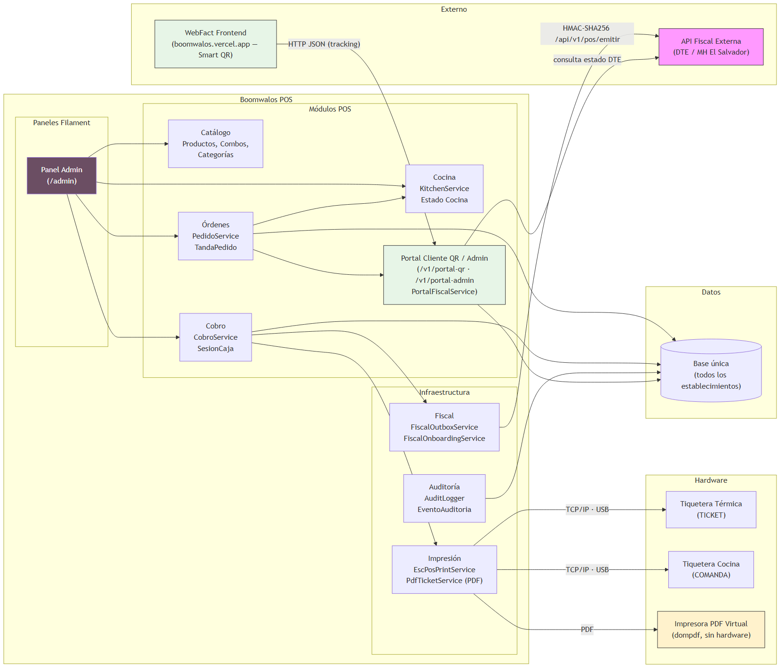
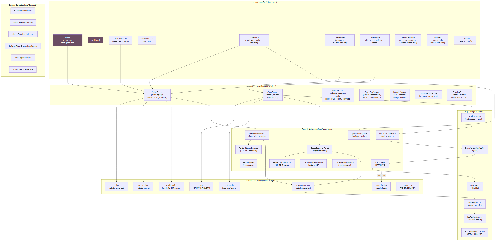
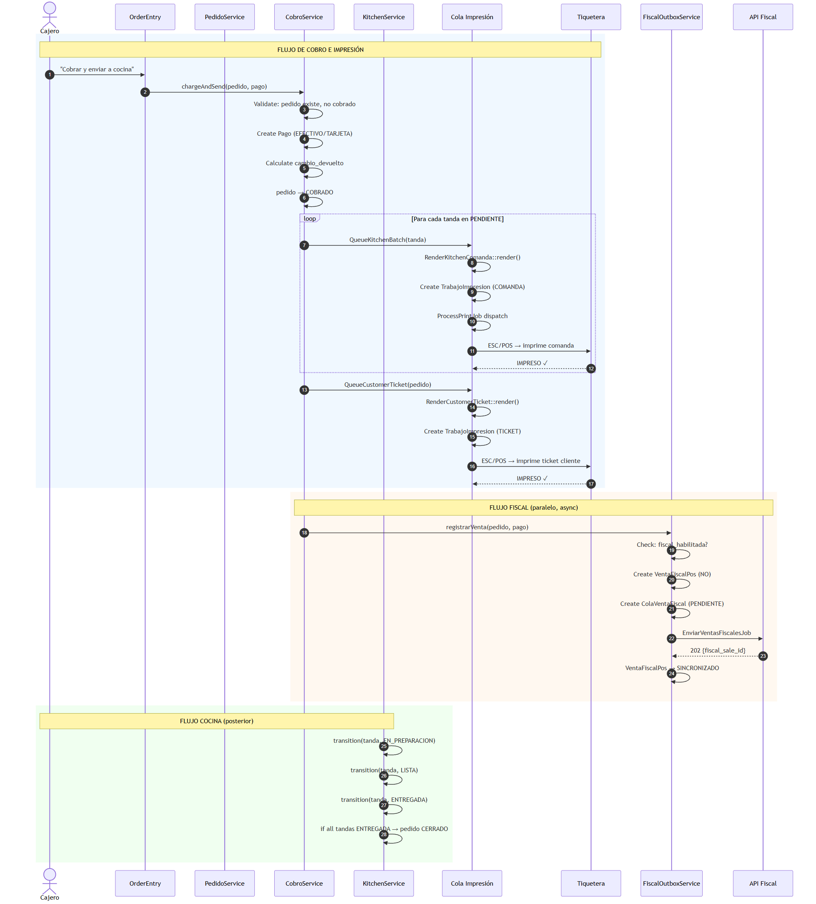

# Arquitectura General — Boomwalos POS

**Versión:** 1.1
**Fecha:** 2026-09-12
**Estado:** Borrador para aprobación
**Autores:** Equipo Boomwalos

> **Actualización 1.1 (2026-09-12):** reconciliación con el commit `3eb6a1f` _Actualizacion de Estados de Cobros + Comanda_.
> - **Se eliminó el subsistema multi-tenant / Platform.** El sistema opera ahora en **base de datos única** con contexto de sucursal (`EstablishmentContext`). Se borraron: `TenantContext`, `ResolveTenant`, `TenantConnectionResolver`, modelos `Platform/*`, `PlatformPanelProvider`, `PlatformTenantResource`, `ManagePlatformTenants`, `config/tenancy.php`, rutas console y sus tests.
> - **Nuevos flujos POS configurables:** `FlujoPos` (`MOSTRADOR_PREPAGO` / `MESA_POSTPAGO`), `PoliticaFlujosPos`, `ConfiguracionFlujosPos` (persistido en `Configuracion` bajo `pos.flujos_operativos`), `ConfiguracionFlujosPosService`, página TI `PosOperationSettings` y `config/pos.php` (`POS_REQUIRE_EXPLICIT_ESTABLISHMENT`).
> - **Masa de pupusa:** `productos.requiere_masa` + `detalles_pedido.configuracion_producto` (migración `2026_09_09_000001`).
> - **Cobros/comanda:** mesa exige `PENDIENTE_COBRO` (solicitar cuenta) y bloquea el cobro si hay líneas pendientes de cocina (sin `tanda_id`); la comanda mapea las líneas pendientes y marca `tanda_id` en cada una; `CobroService` devuelve `QueueTicketResult` tipado.
> - **Impresión:** `Impresora::buscar($tipo, ?int $establecimientoId)` con resolución explícita de sucursal; `TicketPdfController` exige permiso `ver_impresoras` y acceso al establecimiento (403/404).
> - End-to-end validado en caja local (PDF 80mm), suite completa **173/173** en SQLite.

---

## Tabla de Contenidos

1. [Identidad del Proyecto](#1-identidad-del-proyecto)
2. [Visión General del Sistema](#2-visión-general-del-sistema)
3. [Contexto de Sucursal y Modelo de Datos](#3-contexto-de-sucursal-y-modelo-de-datos)
4. [Producto 1: POS (Implementado)](#4-producto-1-pos-implementado)
5. [Producto 2: Portal Cliente QR / WebFact (Implementado)](#5-producto-2-portal-cliente-qr-webfact-implementado)
6. [Producto 3: API Fiscal Externa (Servicio Externo)](#6-producto-3-api-fiscal-externa-servicio-externo)
7. [Flujo de Datos End-to-End](#7-flujo-de-datos-end-to-end)
8. [Integraciones con Hardware](#8-integraciones-con-hardware)
9. [Decisiones Técnicas](#9-decisiones-técnicas)
10. [Supuestos y Restricciones](#10-supuestos-y-restricciones)
11. [Seguridad](#11-seguridad)
12. [Auditoría y Observabilidad](#12-auditoría-y-observabilidad)
13. [Disponibilidad](#13-disponibilidad)
14. [Riesgos Arquitectónicos](#14-riesgos-arquitectónicos)
15. [Decisiones Pendientes](#15-decisiones-pendientes)
16. [Apéndice A: Matriz de Enums](#16-apéndice-a-matriz-de-enums)
17. [Apéndice B: Schema de Base de Datos](#17-apéndice-b-schema-de-base-de-datos)
18. [Apéndice C: Stack Tecnológico](#18-apéndice-c-stack-tecnológico)

---

## 1. Identidad del Proyecto

| Campo | Valor |
|---|---|
| Nombre interno | Boomwalos-POS |
| Nombre de producto | POS para Pupuserías |
| Stack principal | PHP 8.3, Laravel 13, Filament 5.7 |
| Frontend | Tailwind CSS 4, Vite 8, Livewire 3 |
| RBAC | Spatie Laravel Permission 8.3 |
| Testing | PHPUnit 12.5 |
| Base de datos (producción) | MySQL (base única, contexto de sucursal por establecimiento) |
| Base de datos (desarrollo) | SQLite |
| Impresión | ESC/POS nativo (`mike42/escpos-php`) + PDF virtual (`barryvdh/laravel-dompdf`) |
| Zona horaria | `America/El_Salvador` (UTC-6) |
| Entorno target | El Salvador, pupuserías y restaurantes |

---

## 2. Visión General del Sistema

Boomwalos POS es un sistema punto de venta SaaS diseñado para pupuserías y restaurantes en El Salvador. Soporta tres productos principales:

1. **POS (Implementado ~95%):** Panel administrativo completo con flujos de pedido, cocina, cobro, impresión térmica, reportes y fiscalización.
2. **Portal Cliente QR / WebFact (Implementado):** API pública (`/v1/portal-qr`) con la que los clientes consultan su orden y solicitan documentos fiscales (Factura/CCF) usando el tracking del ticket. Incluye Smart QR impreso en el ticket térmico, enlace WebFact (`boomwalos.vercel.app`) y un panel de administración protegido (`/v1/portal-admin`) con modos de emisión MANUAL, AUTOMÁTICO e HÍBRIDO.
3. **API Fiscal Externa (Servicio Externo):** Servicio de facturación electrónica del MH (Ministerio de Hacienda) de El Salvador, al que POS se comunica vía HTTP con autenticación HMAC-SHA256 y aprovisionamiento de emisores vía onboarding.

### Diagrama de Contexto del Sistema



> **Figura 1.** Contexto general: POS se comunica con hardware (tiqueteras, incluyendo modo PDF virtual) y la API Fiscal externa. El Portal Cliente QR (implementado) también interactúa con la API Fiscal.

---

## 3. Contexto de Sucursal y Modelo de Datos

### Modelo

Tras la eliminación del subsistema multi-tenant (commit `3eb6a1f`, 2026-09-12), el sistema opera como **aplicación de base única**: una sola base de datos MySQL que contiene todas las **sucursales (establecimientos)** y sus tablas operacionales. No existe `tenant_id` ni conexión dinámica por hostname.

**Referencia histórica:** ADR-001 (multiempresa) quedó desactualizado. El aislamiento actual es por **sucursal** vía `EstablishmentContextInterface` + RBAC.

### Contexto de Sucursal (EstablishmentContext)

- `EstablishmentContext` (singleton por request) → `EstablishmentContextInterface`
- Persistido en `session('pos.establishment_id')`; ruta `POST /admin/context/establishment/{establecimiento}`
- Enforce de acceso: administradores ven todas las sucursales; cajeros solo sus succursales asignadas (`establecimiento_usuario`)
- Trait `GuardsEstablishment` fuerza selección de sucursal en páginas operacionales
- `config/pos.php` → `POS_REQUIRE_EXPLICIT_ESTABLISHMENT`: si es `true`, siempre se exige selección explícita de sucursal (default `false`, compatibilidad single-tenant)

### Configuración de Flujos Operativos

Los flujos de operación del POS son configurables por sucursal (página Filament **TI → PosOperationSettings**):

| Clase | Rol |
|---|---|
| `FlujoPos` (enum) | `MOSTRADOR_PREPAGO` (cobrar antes) / `MESA_POSTPAGO` (cobrar después por mesa) |
| `PoliticaFlujosPos` | Modelo de dominio: valida habilitación/flujo por establecimiento y tipo de pedido |
| `ConfiguracionFlujosPos` (VO) | Config solicitada: flujos habilitados + predeterminado; validada por `validate()` |
| `ConfiguracionFlujosPosService` | Oracle de persistencia/lectura (`Configuracion` → `pos.flujos_operativos`) |

Reglas: al menos un flujo activo; el predeterminado debe estar habilitado; permiso `gestionar_configuracion_pos` controla el acceso. Detalle completo en `docs/Fase_0B_Flujos_Operativos_Boomwalos_POS.md`.

### Conexiones de Base de Datos

| Conexión | Propósito |
|---|---|
| `default` (mysql/sqlite) | Única. Contiene todos los datos operacionales y de configuración |

### Diagrama de Componentes POS



> **Figura 2.** Arquitectura en capas del POS: Interfaz → Servicios → Aplicación → Contratos → Persistencia → Infraestructura.

---

## 4. Producto 1: POS (Implementado)

### 4.1 Estructura de Paneles Filament

| Panel | Path | Guard | Propósito |
|---|---|---|---|
| Admin (default) | `/admin` | `web` (User) | POS, catálogo, pedidos, cobro, cocina, reportes, fiscal, TI (flujos POS) |

> El panel `Platform` (`/platform`) fue **eliminado** junto con el multi-tenant (commit `3eb6a1f`).

### 4.2 Navegación del Panel Admin

| Grupo | Elementos |
|---|---|
| *(顶部 custom)* | Punto de Venta, Pedidos, Clientes (placeholder) |
| Administración | Usuarios, Sucursales, Marca de la empresa |
| Catálogo | Productos, Categorías, Combos |
| Operación | Mesas |
| Informes | Informe de Ventas, Informe de Caja, Informe de Cocina, Registro de Actividad |
| Ajustes | Impresoras, Monitor de Impresión |
| Fiscal | Configuración fiscal, Ventas fiscales, Documentos fiscales |

### 4.3 Flujo POS (Paso a Paso)

Los flujos están gobernados por `PoliticaFlujosPos` (configurable en **TI → PosOperationSettings**): `MOSTRADOR_PREPAGO` (cobro previo) o `MESA_POSTPAGO` (cobro posterior).

**Flujo Mesa (`MESA_POSTPAGO`):**

```
Login → Selección de Sucursal → Abrir Caja → Selección de Servicio →
Selección de Mesa → Agregar productos/combos → Enviar a cocina (comanda con tanda_id) →
(agregar items → comanda incremental) → Solicitar cuenta (PENDIENTE_COBRO) →
Cobrar (efectivo/tarjeta) → Imprimir ticket → Pedido CERRADO → Mesa LIBRE
```

Transiciones internas de `PedidoService` (reescrito en `3eb6a1f`):

- Mesa exige `PENDIENTE_COBRO` para cobrar; no se cobra con líneas pendientes de cocina (sin `tanda_id`).
- La comanda mapea **solo las líneas nuevas** (uid = `pedido + COMANDA + ids de línea`) y marca `tanda_id` en cada línea.
- Al reabrir mesa ocupada se libera la mesa; los borradores vacíos se descartan al entrar al POS.
- `CobroService` devuelve `[$pago, $comandaJob, QueueTicketResult]` tipado; mete comanda/ticket en cola (`ProcessPrintJob`) post-commit.

**Flujo Para Llevar (`MOSTRADOR_PREPAGO`):**
Cobro previo, sin mesa (`mesa_id = NULL`); la comanda se genera tras el cobro con las líneas pendientes.

### 4.4 Catálogo

#### Productos

- Modelo: `Producto` (tabla `productos`)
- Campos: `categoria_id`, `nombre`, `precio` (DECIMAL 10,2), `imagen_url`, `disponibilidad`
- Disponibilidad: `DISPONIBLE`, `AGOTADO`, `TEMPORALMENTE_NO_DISPONIBLE`
- Imagen servida desde disco `public`

#### Categorías

- Modelo: `Categoria` (tabla `categorias`)
- Jerárquicas: `parent_id` (nullable), `scopeGroups()` para padres
- Soporte de icono: emoji (string) o imagen de archivo
- Métodos: `iconoType()`, `iconoUrl()`, `isGroup()`

#### Combos

- Modelo: `Combo` (tabla `combos`)
- Precio fijo: `precio_fijo`
- Estructura: `Combo` → `OpcionCombo` (grupos) → `OpcionComboProducto` (pivot a productos)
- Cada grupo tiene: `nombre`, `cantidad_requerida`, `es_obligatorio`
- Validación: `ComboSelectionValidator` asegura cantidades exactas por grupo
- Selección guardada como JSON en `detalle_pedido.seleccion_combo`

### 4.5 Órdenes

#### Modelo de Pedido

- **Dos dimensiones de estado independientes:**
  - **Comercial** (`estado_comercial`): `ABIERTO` → `PENDIENTE_COBRO` → `COBRADO` → `CERRADO` | `CANCELADO`
  - **Cocina** (`estado_cocina` en tandas): `PENDIENTE` → `EN_PREPARACION` → `LISTA` → `ENTREGADA` | `CANCELADA`

#### Tandas (Lotes de Cocina)

- Modelo: `TandaPedido` (tabla `tandas_pedido`)
- Cada tanda es un lote independiente con su propio `estado_cocina`
- Permite envíos incrementales sin reiniciar la cuenta
- Un pedido se cierra (`CERRADO`) solo cuando **todas** sus tandas están en `ENTREGADA`

#### Detalles de Pedido

- Modelo: `DetallePedido` (tabla `detalles_pedido`)
- XOR: `producto_id` (nullable) XOR `combo_id` (nullable) — enforced por CHECK constraint
- Precio capturado al momento de venta (inmutable)
- `estado_linea`: `ACTIVA` o `CANCELADA`
- `tanda_id`: nullable — `NULL` = pendiente de envío, asignado al crear tanda

#### Flujo de Pedido (Service Layer)

| Método en `PedidoService` | Acción |
|---|---|
| `createOrder()` | Crea pedido ABIERTO, asigga mesa (si aplica) |
| `addProduct()` | Agrega línea de producto al pedido |
| `addCombo()` | Agrega combo con selección validada |
| `sendPendingBatch()` | Crea tanda con líneas pendientes, imprime comanda |
| `sendToCashRegister()` | Cambia estado a PENDIENTE_COBRO |
| `cancelOrder()` | Cancela pedido, libera mesa, registra auditoría |
| `cancelSentLine()` | Cancela una línea ya enviada (nueva línea negativa) |

### 4.6 Cobro

- **Modelo:** `CobroService`
- **Métodos de pago:** `EFECTIVO`, `TARJETA` (uno por pedido, sin split)
- **Validación:** Pago no puede exceder monto del pedido (para efectivo, se calcula cambio)
- **Idempotencia:** `lockForUpdate()` previene doble cobro
- **Flujo interno de `applyCharge()`:**
  1. Valida pedido existe y no está cobrado
  2. Crea `Pago` (monto, método, cambio, referencia)
  3. Cambia pedido a `COBRADO`
  4. Para cada tanda PENDIENTE: dispatch `QueueKitchenBatch` (comanda)
  5. Dispatch `QueueCustomerTicket` (ticket cliente)
  6. Libera mesa (si era MESA)
  7. Registra venta fiscal (outbox pattern)
  8. Registra auditoría

### 4.7 Sesión de Caja

- Modelo: `SesionCaja` (tabla `sesion_cajas`)
- Un solo turno activo a la vez por sucursal
- **Apertura:** `monto_inicial`
- **Cierre:** `CierreCajaService` calcula efectivo esperado, valida que no existan pedidos en estado ABIERTO o PENDIENTE_COBRO (ambos bloquean el cierre con `ValidationException`), registra la diferencia entre efectivo contado y esperado
- **Arqueo transparente (divergencia con spec):** El cajero ve el monto inicial, ventas en efectivo, ventas con tarjeta, total de ventas y el **efectivo esperado** antes de ingresar el monto contado (`close-session.blade.php:22-41`). La diferencia se calcula en tiempo real. No hay validación que bloquee el cierre por discrepancia — la diferencia se registra en `sesion_cajas.diferencia` para auditoría. La spec original (`Fase_0A`) define "arqueo ciego"; el código implementa arqueo transparente.
- Pagos vinculados a sesión vía `sesion_caja_id`

### 4.8 Impresión

#### Arquitectura

```
Application Layer (render) → TrabajoImpresion (model) → ProcessPrintJob (queue) → EscPosPrintService → PrinterConnectorFactory → Printer
```

Además de imprimir físicamente, cada `ProcessPrintJob` genera una **copia digital PDF** del trabajo vía `PdfTicketService::saveForJob()` (guardada en `storage/app/public/impresiones/`), consultable en `/admin/impresion/trabajo/{id}/pdf`.

#### Tipos de Impresora

| Tipo | Enum | Propósito |
|---|---|---|
| `TICKET` | `TipoImpresora::TICKET` | Ticket de cliente (cajero) |
| `COMANDA` | `TipoImpresora::COMANDA` | Comanda de cocina |

#### Conexión

| Método | Enum | Implementación |
|---|---|---|
| TCP/IP | `TipoConexionImpresora::RED` | `NetworkPrintConnector` (IP:puerto, default 9100) |
| USB | `TipoConexionImpresora::USB` | `FilePrintConnector` (`/dev/usb/...`) |
| PDF | `TipoConexionImpresora::PDF` | `MemoryPrintConnector` + `PdfTicketService` (dompdf, formato térmico 80mm) — simulación virtual sin hardware |

#### Búsqueda de Impresora

`Impresora::buscar(TipoImpresora $tipo, ?int $establecimientoId = null)` (firma desde `3eb6a1f`):
1. Si no se pasa `$establecimientoId`, usa `EstablishmentContext::idOrNull()`
2. Busca impresora **de la sucursal** (`establecimiento_id` = el solicitado)
3. Fallback: impresoras sin `establecimiento_id` (globales)

Llamadas típicas: comanda/reprint usan `establecimiento_id` explícito del pedido; ticket usa el contexto (con fallback global — p. ej. "Cajero Virtual" PDF global).

#### PDF y Guards de Acceso (desde `3eb6a1f`)

Las rutas de PDF (`/admin/impresion/trabajo/{id}/pdf`, `/admin/impresion/prueba/{id}/pdf`) son servidas por `TicketPdfController` con doble guard:
- `abort_unless(auth()->user()?->can('ver_impresoras'), 403)` — permiso RBAC
- `canAccessEstablishment()` — 404 si el establecimiento del trabajo/impresora no es accesible o difiere del contexto activo

La copia PDF se genera y valida siempre con dompdf (226.77 pt = 80 mm de ancho, tamaño variable según líneas), QR de DTE incluido.

#### Contenido Renderizado

| Clase | Salida |
|---|---|
| `RenderKitchenComanda` | Texto plano: nombre sucursal, COMANDA, destino (Mesa X / Para Llevar), código, fecha, ítems con cantidades, selección de combo, notas de cocina |
| `RenderCustomerTicket` | Texto plano: encabezado sucursal, TICKET DE CLIENTE, ítems con precios, totales, pago, cambio, cajero, pie de marca |

#### Idempotencia

- `TrabajoImpresion.original_uid`: SHA-256 de `pedido_id + tipo + uniqid`
- `firstOrCreate` previene impresiones duplicadas

#### Reimpresión

- `ReprintTicket`: busca contenido original o re-renderiza desde Pago
- Crea nuevo `TrabajoImpresion` marcado `es_reimpresion = true`
- Protegido por sucursal (`EstablishmentContext`)

#### Riesgo de Routing Cross-Branch

`Impresora::buscar()` mantiene un fallback a impresoras **globales** (`establecimiento_id IS NULL`). Si la sucursal activa no tiene impresora del tipo requerido, el job se asigna a una impresora global que puede estar físicamente en otra sucursal. Muchísimos call-sites ya pasan `$establecimientoId` explícito (comanda, reprint), pero `CobroService::createTicketJob` aún cae al fallback del contexto. `TrabajoImpresion` no tiene campo `establecimiento_id`.

### 4.9 Cocina

#### Servicio: `KitchenService`

Máquina de estados para `TandaPedido.estado_cocina`:

```
PENDIENTE → EN_PREPARACIÓN → LISTA → ENTREGADA
                                       ↓
                              (auto-cierra pedido si todas las tandas entregadas)
```

- `transition(tanda, nuevoEstado)`: valida transición permitida
- `isAllowedTransition()`: enforce estricto del flujo
- `closeOrderIfReady()`: si todas las tandas → ENTREGADA, pedido → CERRADO
- Pessimistic locking (`lockForUpdate()`) en transiciones

#### Gap Actual

El `KitchenService` existe pero **no hay UI que invoque `transition()`**. El estado de cocina se queda en PENDIENTE indefinidamente. La cocina opera 100% con comandas impresas en papel físico.

### 4.10 Reportes

| Reporte | Servicio/Método | Métricas |
|---|---|---|
| Ventas | `ReportesService::salesSummary()` | Totales, top productos, por método de pago, por sucursal |
| Caja | `ReportesService::cashSessionDetails()` | Sesiones cerradas, pagos por sesión, discrepancias |
| Cocina | `ReportesService::kitchenAverages()` + `kitchenVolume()` | Tiempo promedio preparación, volumen por estado |
| Actividad | `ReportesService::auditActivity()` | Eventos de auditoría paginados por fecha, usuario, tipo |

### 4.11 Auditoría

- **Modelo:** `AuditLogger` implementa `AuditLoggerInterface`
- **Tabla:** `evento_auditorias` (append-only por convención)
- **Estructura:** `entidad_tipo` (MorphTo), `entidad_id`, `usuario_id`, `tipo_evento`, `payload` (JSON)
- **Eventos registrados:** crear pedido, agregar producto, enviar a cocina, cobrar, cancelar, abrir/cerrar caja, reimprimir

---

## 5. Producto 2: Portal Cliente QR / WebFact (Implementado)

> **Estado:** Implementado en `main` (commit `fc96dca`). El diseño original especificaba una tabla `solicitudes_ticket_qr` con tokens opacos; la implementación simplificó el modelo: la orden se identifica directamente por `numero_seguimiento` (o `codigo_corto`) y las solicitudes se registran en `DocumentoFiscal` (PENDIENTE/EMITIDO/RECHAZADO). No existe tabla de tokens.

### 5.1 Componentes

| Componente | Archivos | Propósito |
|---|---|---|
| Controlador público | `app/Http/Controllers/Api/PortalQrController.php` | Consulta de orden, estado (WebFact-compatible) y solicitud de DTE |
| Servicio de negocio | `app/Services/Portal/PortalFiscalService.php` | `buscarOrden()`, `procesarSolicitudCliente()`, `emitirDteDirecto()`, modos de emisión |
| Controlador admin | `app/Http/Controllers/Api/PortalAdminController.php` | Login de administradores, solicitudes, emisión/rechazo, configuración de modo |
| Auth de portal admin | `PortalAdminTokenService` + `AuthenticatePortalAdmin` | Token Bearer cifrado (`Crypt`), TTL 24h, rol `administrador` obligatorio |
| Smart QR en tickets | `EscPosPrintService`, `RenderCustomerTicket`, `QueueCustomerTicket` | QR gráfico ESC/POS + enlace WebFact en tickets |

### 5.2 Endpoints (`routes/api.php`)

| Método | Ruta | Acceso | Propósito |
|---|---|---|---|
| GET | `/v1/portal-qr/orden/{tracking}` | Público | Consulta la orden (número de seguimiento o código corto) |
| GET | `/v1/portal-qr/estado` | Público | Estado del DTE (`estadoDTE`, `codigoGeneracion`, `selloRecepcion`) — compatible WebFact |
| POST | `/v1/portal-qr/solicitar` | Público | Registra solicitud de Factura/CCF con datos del receptor |
| POST | `/v1/portal-admin/login` | Público | Autenticación (usuario/email + password + rol `administrador`) |
| GET | `/v1/portal-admin/solicitudes` | Bearer token | Listado con filtros (estado, búsqueda) y stats |
| PUT | `/v1/portal-admin/solicitudes/{id}` | Bearer token | Actualiza datos del cliente antes de emitir |
| POST | `/v1/portal-admin/solicitudes/{id}/generar` | Bearer token | Emisión manual del DTE |
| POST | `/v1/portal-admin/solicitudes/{id}/rechazar` | Bearer token | Rechaza solicitud con motivo |
| GET/PUT | `/v1/portal-admin/configuracion` | Bearer token | Consulta/actualiza el modo de emisión |

### 5.3 Modos de Emisión del Portal

Guardados por establecimiento en `Configuracion` (`clave = 'modo_emision_portal'`, `valor = {modo: ...}`).

| Modo | Constante | Comportamiento |
|---|---|---|
| `MANUAL` | `PortalFiscalService::MODO_MANUAL` | Todas las solicitudes quedan PENDIENTE hasta que un administrador revise y apruebe |
| `AUTOMATICO` | `PortalFiscalService::MODO_AUTOMATICO` | Todas las solicitudes se emiten al instante, sin intervención humana (default) |
| `HIBRIDO` | `PortalFiscalService::MODO_HIBRIDO` (recomendado) | Factura (01) se emite automática; CCF (03) pasa a validación manual |

### 5.4 Flujo

1. **Pago:** El cajero cobra → se imprime el ticket térmico con el bloque Smart QR: "¿DESEA FACTURA O CCF?", URL de WebFact (`WEBFACT_URL`, default `https://boomwalos.vercel.app`), `?tracking={numero_seguimiento}` y QR gráfico nativo (la línea `QR_URL:` en el contenido ESC/POS se renderiza con `Printer::qrCode`, ECLEVEL_L, size 6).
2. **Consulta:** El cliente ingresa el tracking en WebFact → WebFact llama a `GET /v1/portal-qr/estado` / `consultarOrden`.
3. **Solicitud:** El cliente envía `nombre`, `email`, `telefono` (obligatorios) + `nit`/`nrc`/`dui`, `tipoDTE` → `POST /v1/portal-qr/solicitar`.
4. **Decisión por modo:** Si emite automático (`AUTOMATICO`, o `HIBRIDO` + Factura) → `emitirDteDirecto()` crea `DocumentoFiscal` EMITIDO con `codigo_generacion`, `sello_recepcion`, `numero_control`. En `MANUAL` (o `HIBRIDO` + CCF) → PENDIENTE.
5. **Panel admin:** Un administrador revisa las solicitudes PENDIENTE, corrige datos del cliente (`actualizarSolicitud`) y emite (`generarDte`) o rechaza con motivo.
6. **Estado:** El cliente verifica el estado en cualquier momento vía el endpoint de estado (idempotente contra `DocumentoFiscal`; si ya existe EMITIDO, se devuelve el DTE existente sin duplicar).

### 5.5 Seguridad del Portal

- `/v1/portal-qr/*` son públicos (sin autenticación; solo `throttle:30,1`); `/v1/portal-admin/*` exigen **Bearer token** cifrado (`Crypt::encryptString`; payload `user_id`, `role=administrador`, `iat`, `exp`, TTL 24h), validado en `AuthenticatePortalAdmin`.
- `solicitar` valida datos del receptor (nombre, email, telefono obligatorios).
- La emisión evita duplicados con `updateOrCreate` sobre `(pedido_id, tipo_documento)`.
- **Gap:** los endpoints `/v1/portal-qr/*` no tienen rate limiting (riesgo R1).

### 5.6 Dependencia de Datos

No requiere tabla nueva: reutiliza `pedidos`, `DocumentoFiscal`, `Configuracion` (`modo_emision_portal`) y `configuraciones_fiscales`.

---

## 6. Producto 3: API Fiscal Externa (Servicio Externo)

### 6.1 Contrato de Comunicación

**Protocolo:** HTTP POST con autenticación HMAC-SHA256

**Endpoint (cliente real `FiscalClient`):** `POST /api/v1/pos/emitir`

**Esquema de firma (`HmacSigner`):** la firma se calcula sobre una **cadena canónica** y NO sobre el body crudo (cambio vs. esquema previo `Contrato_API_Fiscal_v1.md`):

```
cadena = METHOD \n PATH \n TIMESTAMP \n NONCE \n sha256(BODY)
firma  = 'sha256=' + hex(hmac_sha256(cadena, cliente_secret))
```

**Headers requeridos** (nombres configurables vía `config/fiscal.php → hmac`):

| Header | Contenido |
|---|---|
| `X-Client-Id` | `cliente_key` de la sucursal |
| `X-Timestamp` | Unix timestamp (tolerancia ±300s) |
| `X-Nonce` | UUID o token único anti-repetición |
| `X-Signature` | `sha256=<hex>` de la cadena canónica |
| `Idempotency-Key` | `clave_reintento` del payload (anti-duplicado en el proveedor) |

**Request body:**

```json
{
  "clave_reintento": "f-sucursal-pedido-pago",
  "referencia": "POS-YYMMDDHHIISS-XXXX",
  "fecha_emision": "2026-08-24T22:00:00-06:00",
  "monto_total": 15.50,
  "metodo_pago": "EFECTIVO",
  "receptor": { "nombre": "...", "documento": "..." }
}
```

> **Nota sobre referencias:** El campo `referencia` en el request fiscal es el `numero_seguimiento` del pedido (formato `POS-YYMMDDHHIISS-XXXX`). Es distinto de la referencia interna de pago (`REF-YYMMDD-{codigo_corto}`) que se almacena en `Pago.referencia_externa` solo para transacciones con tarjeta. Son dos campos independientes.

**Respuesta exitosa (202):**

```json
{
  "fiscal_sale_id": "UUID",
  "estado": "RECIBIDA",
  "qr_url": null
}
```

**Servidor mock (ENV-ONLY):** el proveedor simulado sigue expuesto en `POST /api/fiscal/v1/ventas` y `POST /api/fiscal/v1/webhooks` (verifica el mismo esquema de firma vía `MockFiscalTrait`).

**Referencia:** `Contrato_API_Fiscal_v1.md` (desactualizado para la firma), `openapi-fiscal-v1.yaml`, `app/docs/guia_completa_sistema/03_SEGURIDAD_HMAC_Y_CLIENTE_FISCAL.md`

### 6.2 Outbox Pattern

La integración fiscal usa el patrón **Outbox** para garantizar que ninguna venta se pierda:

```
CobroService → FiscalSaleRegistrar → FiscalOutboxService::registrarVenta()
  → Crea VentaFiscalPos (estado=NO)
  → Crea ColaVentaFiscal (PENDIENTE, payload serializado)
  → Dispatch EnviarVentasFiscalesJob

EnviarVentasFiscalesJob → FiscalOutboxService::enviarPendientes()
  → Itera ColaVentaFiscal WHERE estado=PENDIENTE
  → Llama FiscalGatewayInterface::enviarVenta()
  → Éxito: VentaFiscalPos → SINCRONIZADO, Cola → ENVIADO
  → Fallo: VentaFiscalPos → ENVIO_FALLIDO, Cola → FALLIDO
```

### 6.3 Estados de Venta Fiscal

| Estado | Significado |
|---|---|
| `NO` | Registrada localmente, no enviada aún |
| `SINCRONIZADO` | API Fiscal recibió la venta (202) |
| `ENVIO_FALLIDO` | Último intento falló (reintento manual disponible) |

### 6.4 Webhooks

**Endpoint:** `POST /api/fiscal/v1/webhooks`

- Eventos con `secuencia` para reconciliación secuencial
- `FiscalWebhookService::reconciliar()`: procesa en orden estricto
- Evento `DTE_EMITIDO`: actualiza `DocumentoFiscal` con `codigo_generacion`, `numero_control`, `sello_recepcion`
- `FiscalSyncState`: rastrea `ultima_secuencia_webhook` por sucursal

### 6.5 Documentos Fiscales

| Tipo | Enum | Descripción |
|---|---|---|
| Factura | `TipoDocumento::FACTURA` | Comprobante de venta al consumidor final |
| CCF | `TipoDocumento::CCF` | Comprobante de Crédito Fiscal (para empresas) |

**Restricciones:**
- UNIQUE en `(pedido_id, tipo_documento)` — pero permite CF + CCF simultáneos (gap conocido)
- Expiración: 48 horas desde `solicitado_at`
- Un solo documento activo por pedido (PENDIENTE o EMITIDO)

### 6.6 Onboarding de Emisor (Provisión Automática)

`app/Services/Fiscal/FiscalOnboardingService.php::provisionar()` aprovisiona un emisor en la API Fiscal y guarda las credenciales en el POS:

1. **UI Filament:** Página `Configuración fiscal` → acción "Activar Facturación (Onboarding)" (`ManageConfiguracionFiscal`). Captura establecimiento, ambiente (`00` pruebas / `01` producción), razón social, NIT, NRC, giro, códigos MH de establecimiento y punto de venta, usuario/clave MH opcionales y la llave privada (texto `private_pkcs8.key` o archivo `.key/.p12/.pfx`, codificada en base64).
2. **Llamada al proveedor:** `POST {FISCAL_ONBOARDING_URL}/api/v1/onboarding/emisor` con header `X-Provisioning-Token: PROVISIONING_TOKEN`. Payload: `emisor`, `establecimiento`, `punto_venta`, `credencial` (p12/laves/password).
3. **Parsing resiliente:** extrae `client_id`/`secret` de múltiples caminos JSON (+ fallback regex sobre el body crudo).
4. **Persistencia:** `ConfiguracionFiscal::updateOrCreate(establecimiento_id)` guarda `razon_social`, `nit`, `nrc`, `ambiente`, `giro`, `codigo_establecimiento`, `codigo_punto_venta`, `cliente_key`, `cliente_secret`, `fiscal_habilitada = true`, `intentos_maximos = 3`.

**Campos nuevos en `configuraciones_fiscales`** (migración `2026_08_20_000002`): `ambiente`, `giro`, `codigo_establecimiento`, `codigo_punto_venta`.

**Config requerida en `.env`:** `FISCAL_API_URL`, `FISCAL_API_TIMEOUT`, `FISCAL_MOCK_ENABLED`, `PROVISIONING_TOKEN`, `WEBFACT_URL`. `config/fiscal.php` define `onboarding_url` (default: `{FISCAL_API_URL}/api/v1/onboarding/emisor`) y `provisioning_token`.

**Modo mock:** con `FISCAL_MOCK_ENABLED=true` la provisión es simulada (`client_id = 'pos-mock-...'`), sin salida HTTP.

---

## 7. Flujo de Datos End-to-End

### 7.1 Flujo Completo: Cobro → Impresión → Fiscal



> **Figura 3.** Secuencia completa de un cobro: impresión de comanda y ticket (síncrono), registro fiscal (asíncrono), y avance de cocina (posterior).

### 7.2 Flujo Mesa (7 Pasos)

| Paso | Acción | Estado Comercial | Estado Cocina |
|---|---|---|---|
| 1 | Selección de mesa | — | — |
| 2 | Crear pedido, agregar productos | ABIERTO | — |
| 3 | Enviar lote 1 a cocina | ABIERTO | PENDIENTE |
| 4 | (Cocina prepara) | ABIERTO | EN_PREPARACIÓN |
| 5 | Cobrar | COBRADO | (depende) |
| 6 | (Cocina entrega) | COBRADO | ENTREGADA |
| 7 | Todas las tandas entregadas | CERRADO | — |

### 7.3 Flujo Para Llevar

Igual al de mesa pero:
- `mesa_id = NULL`, `tipo_pedido = PARA_LLEVAR`
- Sin cambios de estado en mesa
- Liberación automática al cobrar

### 7.4 Flujo Post-Cocina (Agregar Ítems)

1. Pedido ya tiene tanda 1 en cocina (PENDIENTE/EN_PREPARACIÓN)
2. Cajero agrega nuevos ítems
3. Nuevos ítems se asignan a **tanda 2** (nueva tanda)
4. Se imprime comanda **solo para tanda 2** (nunca se re-imprime tanda 1)
5. KDS futuro mostraría ambas tandas bajo el mismo `numero_seguimiento`
6. Pedido se cierra solo cuando **todas** las tandas están ENTREGADA

---

## 8. Integraciones con Hardware

### 8.1 Impresoras Térmicas ESC/POS

**Librería:** `mike42/escpos-php` (v5.x) + `barryvdh/laravel-dompdf` (PDF virtual)

**Arquitectura de impresión:**

```
Application Layer (render texto)
  → TrabajoImpresion (model, estado=PENDIENTE)
  → ProcessPrintJob (Queue, 3 retries, 5s backoff)
  → EscPosPrintService
    → PdfTicketService::saveForJob()  (copia PDF digital, storage/public/impresiones)
    → PrinterConnectorFactory (TCP/IP, USB o Memory/PDF)
    → Printer (ESC/POS)
    → render contenido línea por línea
    → cut paper / QR nativo
    → marca IMPRESO o ERROR
```

### 8.2 Tipos de Conexión

| Tipo | Implementación | Uso |
|---|---|---|
| TCP/IP (RED) | `NetworkPrintConnector($ip, $puerto)` | Impresoras de red (default port 9100) |
| USB | `FilePrintConnector($dispositivo)` | Impresoras USB en Linux (`/dev/usb/lp0`) |
| PDF (Virtual) | `MemoryPrintConnector` (no envía a dispositivo) + `PdfTicketService` con dompdf | Simulador que genera un PDF térmico 80mm (`226.77pt` × alto mm calculado). Array de líneas renderizadas como texto. Ideal para demo/testing sin hardware |

`Impresora::direccionConexion()` devuelve `{ip}:{puerto}` (RED), el dispositivo USB (USB) o `'Simulador Virtual (PDF)'`.

### 8.3 Formato ESC/POS

`EscPosPrintService` formatea el contenido:
- **Encabezado:** detectado por texto en MAYÚSCULAS + largo > 20 chars → centrado + doble altura
- **Separadores:** regex `---...---` → centrado
- **Totales:** palabras clave (TOTAL, PAGO, RECIBIDO, CAMBIO, PEDIDO, COMANDA, TICKET, TANDA, TRACKING) → bold
- **Centrado:** Mesa, ParaLlevar, Fecha, "¿SOLICITAR..."/"¡GRACIAS..." → centrado
- **QR nativo:** la línea `QR_URL:{url}` se imprime como código QR gráfico (`Printer::qrCode`, nivel L, tamaño 6), con fallback a texto si la impresora no soporta el comando

### 8.4 Limitaciones Actuales

- **No hay soporte Bluetooth** (solo TCP/IP, USB y PDF virtual)
- **No hay driver de Windows** (FilePrintConnector es para Linux)
- En Windows/Laragon se usa `createMemory()` para testing (output a buffer, no a dispositivo físico)
- **No hay auto-detección de impresoras** (configuración manual)
- `impresoras.puerto` ahora es nullable (migración `2026_08_20_000003`); el mutador `setPuertoAttribute` normaliza a 9100 si está vacío

---

## 9. Decisiones Técnicas

### 9.1 Arquitectura por Capas con Contratos

```
Interface (Filament/Livewire)
  → Application (casos de uso)
  → Services (lógica de negocio)
  → Contracts (interfaces)
  → Adapters (HTTP, Queue, Mock)
  → Persistence (Models + Migrations)
```

Todos los servicios cross-cutting están bound via interfaces en `AppServiceProvider`:
- `FiscalGatewayInterface` → `HttpFiscalGateway` / `MockFiscalGateway`
- `KitchenDispatcherInterface` → `QueueKitchenBatch`
- `CustomerTicketDispatcherInterface` → `QueueCustomerTicket`
- `AuditLoggerInterface` → `AuditLogger`
- `BrandingServiceInterface` → `BrandingService`
- `EstablishmentContextInterface` → `EstablishmentContext`

### 9.2 Estado de Cocina Per-Tanda

El estado de cocina **no** es un campo en `pedidos`. Cada `TandaPedido` tiene su propio `estado_cocina`. Esto permite:
- Envíos incrementales (múltiples tandas bajo un mismo pedido)
- Estados independientes por lote
- Cierre correcto solo cuando todas las tandas terminan

### 9.3 Pessimistic Locking

Operaciones críticas usan `lockForUpdate()` para prevenir race conditions:
- `PedidoService`: agregar productos, enviar a cocina
- `CobroService`: cobrar pedido (previene doble cobro)
- `CierreCajaService`: cerrar caja
- `KitchenService`: transiciones de estado

### 9.4 Outbox Pattern para Fiscal

En vez de enviar directamente a la API Fiscal dentro de la transacción de cobro:
1. Se registra localmente (`VentaFiscalPos` + `ColaVentaFiscal`)
2. Se despacha job asíncrono
3. Si la API falla, se reintenta manualmente
4. **Ninguna venta se pierde** aunque la API esté caída

### 9.5 Arqueo Transparente (divergencia con spec)

La especificación original (`Fase_0A`) define un "arqueo ciego", pero el código implementa un cierre transparente: el cajero ve el efectivo esperado antes de ingresar el contado, y la diferencia se muestra en tiempo real. No hay bloqueo por discrepancia — la diferencia se registra en `sesion_cajas.diferencia` para auditoría.

**Decisión de diseño pendiente:** ¿mantener el comportamiento actual (transparente) o implementar el arqueo ciego original?

### 9.6 Filament v5 como Framework

- Auto-discovery de Resources y Pages
- Custom Login dual-mode (cajero/admin)
- Render hooks para sidebar, topbar, global search
- Tema CSS custom via Vite + Tailwind
- POS pages ocultan sidebar/topbar (experiencia kiosk)

### 9.7 ESC/POS Nativo

Sin dependencia de `printer.js` o librerías JavaScript. Impresión directa vía PHP con `mike42/escpos-php`. Ventaja: funciona en cualquier OS con acceso a la impresora (red o USB).

---

## 10. Supuestos y Restricciones

### Supuestos

1. Una mesa tiene **un solo pedido activo** a la vez (enforce en `PedidoService`, no en DB)
2. Un pedido tiene **un solo pago** (sin split payments)
3. Solo dos métodos de pago: EFECTIVO y TARJETA
4. Sin inventario de ingredientes (no se descuenta stock)
5. Sin modificadores free-text en cocina (solo notas predefinidas)
6. Cada empresa tiene exactamente una DB operacional
7. Impresoras configuradas manualmente por el administrador
8. La API Fiscal está disponible la mayor parte del tiempo
9. Los clientes acceden al POS solo vía browser web (no app móvil)

### Restricciones

1. **Un pedido por mesa** — no se pueden fusionar pedidos
2. **Sin transferencia de mesas** — el pedido queda en la mesa original
3. **Sin reservaciones** — modelo de primer llegado, primero servido
4. **Precio inmutable** — el precio se captura al momento de venta, no cambia si el catálogo se actualiza
5. **Sesión de caja obligatoria** — no se puede cobrar sin turno abierto
6. **Cancelación con auditoría** — toda cancelación registra motivo y actor
7. **Fiscal opcional** — cada sucursal puede tener fiscal habilitada o no
8. **Un solo turno de caja a la vez** por sucursal

---

## 11. Seguridad

### 11.1 RBAC (Role-Based Access Control)

**Librería:** Spatie Laravel Permission 8.3

| Rol | Permisos |
|---|---|
| `administrador` | Todos los permisos (full access) |
| `cajero` | `crear_pedido`, `cobrar_pedido`, `abrir_caja`, `cerrar_caja`, `ver_impresoras` |

**Permisos sin asignar (pendiente de decisión de negocio):**
- `aplicar_descuento`
- `cancelar_pedido` (existe pero no asignado a cajero)
- `gestionar_solicitudes_fiscales`

### 11.2 Autenticación Dual

| Modo | Campos | Rol requerido |
|---|---|---|
| Cajero | `codigo` (2-6 dígitos) + `PIN` (4 dígitos) | `cajero` |
| Admin | `email` + `password` | `administrador` |

Rate limiting: 5 intentos. Post-login:
- Admin → Dashboard
- Cajero → EstablishmentSelection (si múltiples) → OpenSession (si no hay turno) → ServiceSelection

### 11.3 Aislamiento por Sucursal (reemplaza Tenant Isolation)

- Base de datos **única**; el aislamiento es lógico por `establecimiento_id` + RBAC.
- `EstablishmentContext` (singleton) fuerza la sucursal activa; `canAccess()` valida administrador → todo; cajero → sucursales asignadas u única sucursal (conveniencia single-tenant).
- Guards en páginas operacionales (`GuardsEstablishment`) y en rutas web de impresión (permiso + `canAccessEstablishment`).
- `POS_REQUIRE_EXPLICIT_ESTABLISHMENT=true` elimina el atajo de sucursal única.
- El aislamiento por **tenant/DB dinámica** fue eliminado en `3eb6a1f`.

### 11.4 Fiscal: HMAC-SHA256

- Cada sucursal tiene `cliente_key` (pública) y `cliente_secret` (encriptada)
- Cada request incluye firma HMAC del body JSON
- Clock skew: ±300 segundos
- Verificación timing-safe vía `hash_equals()`

### 11.5 Establecimiento: GuardsEstablishment

- Trait `GuardsEstablishment` en páginas operacionales del POS
- Fuerza selección de sucursal antes de operar
- Admin ve todas; cajero solo las asignadas (`establecimiento_usuario`)

### 11.6 Credenciales Fiscal

- `cliente_secret` almacenado **encriptado** en DB (Eloquent encrypted casting)
- Nunca se loguea ni se expone en responses
- Modo mock: solo vía ENV, nunca en producción

### 11.7 Auditoría

- `EventoAuditoria`: append-only por convención
- Cada acción significativa (crear, cobrar, cancelar, reimprimir) registra: entidad, usuario, evento, payload JSON
- No hay retención configurable ( crece indefinidamente)

### 11.8 Portal Cliente QR y Admin API

- **Público:** `/v1/portal-qr/*` sin autenticación (solo `throttle:30,1`). La orden se expone vía `numero_seguimiento` (opaco) o `codigo_corto` (predictible de 1-4 dígitos); el endpoint `estado` no devuelve datos sensibles del cliente.
- **Admin:** `/v1/portal-admin/*` exige **Bearer token** auto-contenido y cifrado (`PortalAdminTokenService::generateToken`, `Crypt::encryptString` con `APP_KEY`), TTL 24h, rol `administrador` verificado contra la DB en cada request (`AuthenticatePortalAdmin`).
- **Tokens cancelables:** el token es stateless (depende de `APP_KEY`); no hay revocación individual ni rotación automática. No usa Laravel Sanctum (ver R12).
- **CORS:** `config/cors.php` permite `allowed_origins => ['*']` sobre `api/*` — necesario para WebFact (frontend externo), pero amplío la superficie (riesgo R1).

---

## 12. Auditoría y Observabilidad

### 12.1 EventoAuditoria

| Campo | Tipo | Descripción |
|---|---|---|
| `entidad_tipo` | string | Morph type (App\Models\Pedido, etc.) |
| `entidad_id` | bigint | ID de la entidad |
| `usuario_id` | bigint FK | Quién realizó la acción |
| `tipo_evento` | string | `pedido_creado`, `pedido_cobrado`, `pedido_cancelado`, etc. |
| `payload` | JSON | Detalles (montos, motivo, ítems) |

### 12.2 Reportes

4 informes disponibles en el panel admin:
- **Ventas:** Totales por día, top productos, por método de pago, por sucursal
- **Caja:** Sesiones cerradas, pagos individuales, discrepancias
- **Cocina:** Tiempo promedio de preparación, volumen por estado, por sucursal
- **Actividad:** Log de eventos de auditoría, filtrable por fecha, usuario, tipo

### 12.3 PrintMonitor

Página en Ajustes que muestra todos los `TrabajoImpresion`:
- Filtro por estado (PENDIENTE, PROCESANDO, IMPRESO, ERROR)
- Filtro por tipo (TICKET, COMANDA)
- Permite re-intentar jobs fallidos
- **Propósito:** debug y monitoreo administrativo, no operativo de cocina

### 12.4 Gap: Observabilidad

- **No hay logging estructurado** (JSON logs para ingestión)
- **No hay métricas** (Prometheus, etc.)
- **No hay health checks** endpoint
- **No hay alertas** (Slack, email, etc.)
- **No hay tracing** distribuido

---

## 13. Disponibilidad

### 13.1 Cola de Impresión

- `ProcessPrintJob`: 3 reintentos, 5 segundos de backoff
- Estado se actualiza en DB (no se pierde trabajo si el worker falla)
- Reintentos manuales vía PrintMonitor

### 13.2 Outbox Fiscal

- `ColaVentaFiscal`: persiste el payload completo
- Reintentos manuales vía `VentaFiscalPosResource` (botón reintentar)
- Si la API Fiscal está caída, las ventas se acumulan localmente

### 13.3 Session y Cache

- Session driver: `database` (no file — sobrevive restarts del worker)
- Cache driver: `database` (no file)
- Redis configurado pero no es default

### 13.4 Gap: Disponibilidad

- **No hay health check endpoint** para load balancers
- **No hay circuit breaker** para la API Fiscal
- **No hay rate limiting** en endpoints internos
- **No hay CDN** para assets estáticos
- **No hay backup automático** documentado
- `public/build` está tracked en git (deploy simplificado pero no óptimo)

---

## 14. Riesgos Arquitectónicos

| # | Riesgo | Impacto | Probabilidad | Mitigación |
|---|---|---|---|---|
| R1 | **Endpoints públicos del portal** — `/v1/portal-qr/*` son públicos (sin autenticación) con CORS `*`; abuso puede saturar emisión de DTEs (costo/validez). Mitigado parcialmente con `throttle:30,1` | Medio | Media | Aplicar rate limiting más estricto a rutas públicas; restringir CORS por origen WebFact |
| R2 | **Sin UI de cocina** — KitchenService existe pero nadie invoca `transition()` | Alto | Alta | Implementar vista de cocina o mejorar PrintMonitor |
| R3 | **Impresión sin Bluetooth** — limita hardware móvil | Medio | Media | Implementar `EscPosBluetoothDriver` (fase P2) |
| R4 | **Documento fiscal: UNIQUE(pedido_id, tipo)** permite CF+CCF simultáneos | Medio | Media | Migración para enforce ONE active document per order |
| R5 | ~~Multi-tenant fiscal jobs~~ — eliminado con el multi-tenant (`3eb6a1f`) | — | — | — |
| R6 | **Sin health checks** — no hay forma de monitorear salud del sistema | Medio | Alta | Implementar `/health` endpoint |
| R7 | **Sin rate limiting** en endpoints internos | Bajo | Baja | Aplicar middleware de rate limiting |
| R8 | **Arqueo transparente** — no hay bloqueo por discrepancia; la diferencia solo se registra, puede pasar desapercibida | Bajo | Media | Proceso de reconciliación periódica (reportes de caja) |
| R9 | **Auditoría sin retención** — tabla crece indefinidamente | Bajo | Alta | Definir política de retención + archivado |
| R10 | **`public/build` en git** — assets compilados versionados | Bajo | Alta | Mover a deploy pipeline (build en server) |
| R11 | **Impresora cross-branch** — Fallback a impresoras globales puede routingar jobs a impresoras de otra sucursal. Sin validación en ejecución. `TrabajoImpresion` sin `establecimiento_id`. | Alto | Media | Asignar `establecimiento_id` a `TrabajoImpresion`, validar sucursal en `EscPosPrintService` |
| R12 | **Token de portal admin custom** (`Crypt::encryptString`, stateless, TTL 24h) — dependiente de `APP_KEY`, sin revocación individual ni rotación; no usa Sanctum | Medio | Baja | Evaluar migración a Sanctum personal access tokens (revocables, expiración nativa) |

---

## 15. Decisiones Pendientes

| # | Decisión | Dependencias | Prioridad |
|---|---|---|---|
| ~~D1~~ | ~~Portal Cliente QR: implementación completa~~ | **Implementado** (ver Sección 5) | — |
| D2 | **Migración: ONE active fiscal document per order** | Evitar CF+CCF simultáneos | P1 |
| D3 | **PlanchaAggregationService** — vista resumen cocina (dual-view) | UI para cocineros, producción + entrega individual | P1 |
| D4 | **Bluetooth printer support** — driver EscPosBluetooth | Librería, hardware de prueba | P2 |
| D5 | **Health check endpoint** — `/health` para load balancers | Implementación mínima | P2 |
| D6 | **Rate limiting** en endpoints internos y públicos del portal (`/v1/portal-qr/*`) + restringir CORS por origen | Middleware Laravel | P2 |
| D7 | **Logging estructurado** — JSON logs para monitoreo | Configuración Laravel logging | P3 |
| D8 | **Ingredient inventory control** — descontar stock | Modelo de ingredientes, recetas | P3 (Plan Cadena) |
| D9 | **Multi-cash register** — múltiples cajas por sucursal | Cambio en SesionCaja, UI | P3 (Plan Cadena) |
| D10 | **Política de retención de auditoría** | Definición de negocio, archivado | P3 |
| D11 | **Arqueo ciego vs. transparente** — La spec original pide arqueo ciego; el código implementa arqueo transparente. Definir cuál es el comportamiento deseado. | P1 |
| D12 | **Módulo de Soporte** — Diseño ya definido (Filament Page, 4 tabs, tabla `reportes_soporte`, permisos `ver_reportes`) pero no implementado. Solo existe placeholder muerto en sidebar (`sidebar-footer.blade.php`). Implementar según diseño acordado. | P2 |
| D13 | **Migrar portal admin a Sanctum** — tokens revocables en vez del Bearer cifrado custom (R12) | Sanctum personal access tokens | P2 |

---

## 16. Apéndice A: Matriz de Enums

| Enum | Valores | Archivo |
|---|---|---|
| `DisponibilidadProducto` | `DISPONIBLE`, `AGOTADO`, `TEMPORALMENTE_NO_DISPONIBLE` | `app/Enums/DisponibilidadProducto.php` |
| `EstadoCocina` | `PENDIENTE`, `EN_PREPARACION`, `LISTA`, `ENTREGADA`, `CANCELADA` | `app/Enums/EstadoCocina.php` |
| `EstadoColaVentaFiscal` | `PENDIENTE`, `ENVIADO`, `FALLIDO` | `app/Enums/EstadoColaVentaFiscal.php` |
| `EstadoComercialPedido` | `ABIERTO`, `PENDIENTE_COBRO`, `COBRADO`, `CERRADO`, `CANCELADO` | `app/Enums/EstadoComercialPedido.php` |
| `EstadoDocumentoFiscal` | `PENDIENTE`, `EMITIDO`, `RECHAZADO` | `app/Enums/EstadoDocumentoFiscal.php` |
| `EstadoImpresion` | `PENDIENTE`, `PROCESANDO`, `IMPRESO`, `ERROR` | `app/Enums/EstadoImpresion.php` |
| `EstadoLineaPedido` | `ACTIVA`, `CANCELADA` | `app/Enums/EstadoLineaPedido.php` |
| `EstadoMesa` | `LIBRE`, `OCUPADA` | `app/Enums/EstadoMesa.php` |
| `EstadoVentaFiscal` | `SINCRONIZADO`, `NO`, `ENVIO_FALLIDO` | `app/Enums/EstadoVentaFiscal.php` |
| `EstadoWebhookPos` | `PENDIENTE`, `PROCESADO`, `RECONCILIADO` | `app/Enums/EstadoWebhookPos.php` |
| `MetodoPago` | `EFECTIVO`, `TARJETA` | `app/Enums/MetodoPago.php` |
| `OrigenPedido` | `CAJA`, `DISPOSITIVO` | `app/Enums/OrigenPedido.php` |
| `TipoConexionImpresora` | `RED`, `USB`, `PDF` | `app/Enums/TipoConexionImpresora.php` |
| `TipoDocumento` | `FACTURA`, `CCF` | `app/Enums/TipoDocumento.php` |
| `TipoImpresora` | `TICKET`, `COMANDA` | `app/Enums/TipoImpresora.php` |
| `TipoPedido` | `MESA`, `PARA_LLEVAR` | `app/Enums/TipoPedido.php` |
| `TipoTrabajoImpresion` | `TICKET`, `COMANDA` | `app/Enums/TipoTrabajoImpresion.php` |
| `ZonaMesa` | `SALON`, `TERRAZA`, `BAR` | `app/Enums/ZonaMesa.php` |

---

## 17. Apéndice B: Schema de Base de Datos

### Tablas Operacionales (conexión default — base única)

```
establecimientos
  ├── id, nombre, direccion
  ├── codigo_establecimiento, codigo_punto_venta
  └── timestamps

usuarios (no "users" — tabla custom)
  ├── id, nombre, usuario (login code), email
  ├── password (hashed)
  └── timestamps

establecimiento_usuario (pivot)
  ├── establecimiento_id (FK)
  └── usuario_id (FK)

categorias
  ├── id, nombre, descripcion, activa
  ├── parent_id (FK → categorias, nullable)
  ├── icono (string, nullable)
  └── timestamps

productos
  ├── id, categoria_id (FK)
  ├── nombre, precio (decimal 10,2)
  ├── imagen_url (string, nullable)
  ├── disponibilidad (enum)
  └── timestamps

combos
  ├── id, nombre, precio_fijo (decimal 10,2)
  ├── imagen_url (string, nullable)
  ├── disponibilidad (enum)
  └── timestamps

opciones_combo
  ├── id, combo_id (FK)
  ├── nombre, cantidad_requerida (int)
  ├── es_obligatorio (bool)
  └── timestamps

opciones_combo_productos (pivot)
  ├── opcion_combo_id (FK)
  └── producto_id (FK)

mesas
  ├── id, establecimiento_id (FK)
  ├── numero (int), zona (enum: SALON/TERRAZA/BAR)
  ├── estado (enum: LIBRE/OCUPADA)
  ├── activa (bool)
  └── timestamps

pedidos
  ├── id, numero_seguimiento (string, unique)
  ├── tipo_pedido (enum: MESA/PARA_LLEVAR)
  ├── mesa_id (FK, nullable)
  ├── establecimiento_id (FK)
  ├── usuario_id (FK)
  ├── origen_pedido (enum: CAJA/DISPOSITIVO)
  ├── codigo_corto (int), fecha_codigo (date)
  ├── estado_comercial (enum)
  └── timestamps

tandas_pedido
  ├── id, pedido_id (FK)
  ├── numero_tanda (int)
  ├── estado_cocina (enum)
  └── timestamps
  INDEX: idx_tandas_cocina_created (estado_cocina, created_at)

detalles_pedido
  ├── id, pedido_id (FK)
  ├── tanda_id (FK, nullable)
  ├── estado_linea (enum: ACTIVA/CANCELADA)
  ├── cancelada_por_id (FK → usuarios, nullable)
  ├── cancelada_at (timestamp, nullable)
  ├── motivo_cancelacion (string, nullable)
  ├── producto_id (FK, nullable)  -- XOR con combo_id
  ├── combo_id (FK, nullable)     -- XOR con producto_id
  ├── cantidad (int)
  ├── precio_unitario (decimal)
  ├── seleccion_combo (json, nullable)
  └── timestamps

notas_cocina
  ├── id, nombre, activo (bool)
  └── timestamps

detalle_pedido_notas (pivot)
  ├── detalle_pedido_id (FK)
  └── nota_cocina_id (FK)

pagos
  ├── id, pedido_id (FK, unique — un pago por pedido)
  ├── sesion_caja_id (FK, nullable)
  ├── metodo_pago (enum: EFECTIVO/TARJETA)
  ├── monto_recibido, cambio_devuelto (decimal)
  ├── referencia_externa (string, nullable)
  └── timestamps

sesion_cajas
  ├── id, establecimiento_id (FK)
  ├── usuario_apertura_id (FK → usuarios)
  ├── usuario_cierre_id (FK → usuarios, nullable)
  ├── monto_inicial (decimal)
  ├── total_efectivo, total_tarjeta, total_ventas (decimal)
  ├── efectivo_esperado, efectivo_contado, diferencia (decimal)
  ├── fecha_apertura, fecha_cierre (timestamps)
  └── timestamps

impresoras
  ├── id, nombre
  ├── tipo (enum: TICKET/COMANDA)
  ├── establecimiento_id (FK, nullable)
  ├── conexion (enum: RED/USB/PDF)
  ├── ip (string, nullable)
  ├── puerto (int, nullable, default 9100 — mutador fuerza 9100 si está vacío)
  ├── dispositivo_usb (string, nullable)
  ├── activa (bool)
  ├── configuracion (json, nullable)
  ├── ultima_conexion_exitosa_at (timestamp, nullable)
  └── timestamps

trabajo_impresion
  ├── id, impresora_id (FK, nullable)
  ├── tanda_id (FK, nullable)
  ├── pedido_id (FK)
  ├── tipo_trabajo (enum: TICKET/COMANDA)
  ├── es_reimpresion (bool)
  ├── reimpresion_de_id (FK → trabajo_impresion, nullable)
  ├── motivo_reimpresion (string, nullable)
  ├── usuario_reimpresion_id (FK → usuarios, nullable)
  ├── original_uid (string — idempotency key)
  ├── estado (enum: PENDIENTE/PROCESANDO/IMPRESO/ERROR)
  ├── contenido (longText — ESC/POS renderizado)
  ├── intentos (int)
  ├── ultimo_error (string, nullable)
  ├── impreso_at (timestamp, nullable)
  └── timestamps

configuraciones_fiscales
  ├── id, establecimiento_id (FK, unique)
  ├── razon_social, nit, nrc (string)
  ├── ambiente (string 2, default '00' — 00 pruebas / 01 producción)
  ├── giro (string 250, nullable)
  ├── codigo_establecimiento (string 10, default '0001')
  ├── codigo_punto_venta (string 10, default '001')
  ├── fiscal_habilitada (bool)
  ├── cliente_key (string)
  ├── cliente_secret (string, encrypted)
  ├── intentos_maximos (int)
  └── timestamps

ventas_fiscales_pos
  ├── id, establecimiento_id (FK)
  ├── pedido_id (FK), pago_id (FK)
  ├── referencia (string)
  ├── monto_total (decimal)
  ├── metodo_pago (string)
  ├── receptor (json, nullable)
  ├── fiscal_sale_id (string, nullable)
  ├── estado (enum: SINCRONIZADO/NO/ENVIO_FALLIDO)
  ├── sincronizado_at (timestamp, nullable)
  └── timestamps

cola_ventas_fiscales
  ├── id, venta_fiscal_pos_id (FK, unique)
  ├── clave_reintento (string)
  ├── payload_envio (json)
  ├── estado (enum: PENDIENTE/ENVIADO/FALLIDO)
  ├── intentos (int)
  ├── ultimo_error (string, nullable)
  └── timestamps

documento_fiscales
  ├── id, pedido_id (FK)
  ├── venta_fiscal_pos_id (FK, nullable)
  ├── tipo_documento (enum: FACTURA/CCF)
  ├── numero_control, codigo_generacion, sello_recepcion (string, nullable)
  ├── estado (enum: PENDIENTE/EMITIDO/RECHAZADO)
  ├── datos_solicitante (json, nullable)
  ├── solicitado_at, expires_at (timestamps, nullable)
  └── timestamps
  UNIQUE: (pedido_id, tipo_documento)

fiscal_sync_states
  ├── id, establecimiento_id (FK, unique)
  ├── ultima_secuencia_webhook (bigint)
  └── timestamps

webhook_events_pos
  ├── id, establecimiento_id (FK)
  ├── venta_fiscal_pos_id (FK, nullable)
  ├── secuencia (bigint)
  ├── tipo (string)
  ├── payload (json)
  ├── estado (enum: PENDIENTE/PROCESADO/RECONCILIADO)
  ├── recibido_at (timestamp)
  └── timestamps

evento_auditorias
  ├── id
  ├── entidad_tipo, entidad_id (MorphTo)
  ├── usuario_id (FK → usuarios)
  ├── tipo_evento (string)
  ├── payload (json)
  └── timestamps

configuraciones
  ├── id, establecimiento_id (FK)
  ├── clave (string)
  ├── valor (json)
  └── timestamps

secuencias_pedidos
  ├── id, establecimiento_id (FK)
  ├── fecha_codigo (date)
  ├── secuencia (int)
  └── timestamps
```

---

## 18. Apéndice C: Stack Tecnológico

| Capa | Tecnología | Versión |
|---|---|---|
| **Lenguaje** | PHP | 8.3 |
| **Framework** | Laravel | 13 |
| **Admin Panel** | Filament | 5.7 |
| **RBAC** | Spatie Laravel Permission | 8.3 |
| **Frontend** | Tailwind CSS | 4 |
| **Build Tool** | Vite | 8 |
| **Reactivity** | Livewire | 3 |
| **Testing** | PHPUnit | 12.5 |
| **Impresión** | mike42/escpos-php | 5.x |
| **PDF (impresión virtual)** | barryvdh/laravel-dompdf | 3.1 |
| **DB (producción)** | MySQL | — |
| **DB (desarrollo)** | SQLite | — |
| **Session/Cache** | Database driver | — |
| **Queue** | Database driver | — |
| **Fonts** | Manrope, Instrument Sans | — |
| **Icons** | Heroicons (via Filament) | — |

---

## Diagramas Fuente

Los diagramas Mermaid fuente están en `app/docs/diagrams/`:

| Archivo | Diagrama |
|---|---|
| `01-contexto.mmd` | Contexto del Sistema |
| `02-componentes-pos.mmd` | Componentes POS |
| `03-portal-qr.mmd` | Portal Cliente QR (flujo) |
| `04-flujo-datos.mmd` | Flujo de Datos End-to-End |

> `05-multi-tenancy.*` fue eliminado (multi-tenant removido en `3eb6a1f`).

Para regenerar los PNG:

```bash
npx @mermaid-js/mermaid-cli -i app/docs/diagrams/01-contexto.mmd -o app/docs/diagrams/01-contexto.png -w 2400 -H 1200 -b white
```

---

**Fin del documento.**
