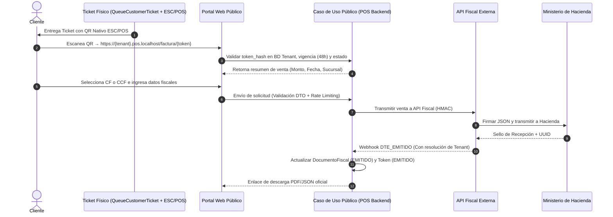
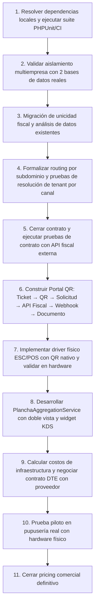

# Especificación Técnica y Modelo de Negocio: POS para Pupuserías

**Producto Oficial:** POS para Pupuserías  
*(Identificador interno del repositorio: Boomwalos-POS)*  
**Stack Tecnológico Base:** PHP 8.3 | Laravel 13.8 | Filament 5.7 | Spatie Permission 8.3  
**Arquitectura:** Sistema modular basado en Service Layer, Contratos, Adaptadores y Separación de Responsabilidades  
**Alcance Geográfico Inicial:** El Salvador (diseñado para normativa DTE del Ministerio de Hacienda; arquitectura extensible a Centroamérica en fases posteriores mediante adaptadores fiscales por país)  
**Versión del Documento:** 4.4 — Línea Base Aprobada de Referencia  
**Fecha:** Agosto 2026  

---

## 1. Resumen Ejecutivo y Propuesta de Valor

El sector de pupuserías y restaurantes de alta rotación en El Salvador opera bajo dinámicas comerciales específicas que los sistemas POS convencionales no logran resolver con agilidad:
1. **Alta velocidad de despacho y comandas incrementales (Tandas):** Los comensales solicitan productos adicionales durante su consumo sin reiniciar la cuenta.
2. **Configuración Dinámica de Combos:** Promociones por slots que requieren mezclas arbitrarias de sabores (ej. *Combo de 10 pupusas*: 4 revueltas, 3 queso, 3 chicharrón).
3. **Optimización de Plancha:** Necesidad de conocer el acumulado en vivo de pupusas a preparar desglosadas por sabor en cocina, manteniendo la trazabilidad por tanda y destino.
4. **Flujos Fiscales Configurables:** Emisión de documentos fiscales mediante el flujo autorizado y configurado por el negocio y su asesor tributario (modalidad de emisión directa en caja o diferida por solicitud del cliente vía código QR en el ticket).

> [!NOTE]
> **Declaración de Neutralidad y Cumplimiento Legal:**
> El sistema no está diseñado para ocultar ventas ni eludir obligaciones tributarias. Las políticas y modalidades de emisión de documentos fiscales deben ser aprobadas formalmente por el titular del establecimiento y su asesor contable/tributario, respetando la normativa legal aplicable.

---

## 2. Matriz de Estado Técnico Real y Verificable

Para mantener una evaluación rigurosa y auditable, se descartan porcentajes subjetivos y se clasifica cada módulo según cinco niveles de madurez técnica:

1. **Implementado en código:** Lógica escrita en controladores, servicios, modelos y vistas.
2. **Validado con pruebas automatizadas:** Suites de PHPUnit ejecutadas con éxito en entorno de integración.
3. **Validado con integración real:** Comunicación probada contra servicios y APIs de terceros en staging/producción.
4. **Probado en hardware:** Comprobado físicamente en pantallas táctiles, impresoras térmicas o red local.
5. **Listo para producción:** Aprobado para despliegue y venta comercial formal.

| Módulo / Componente | Nivel de Madurez Actual | Archivos de Referencia | Evidencia y Estado de Validación |
| :--- | :--- | :--- | :--- |
| **Punto de Venta (POS)** | **Implementado en código** | `app/Filament/Pages/Pos/OrderEntry.php`<br>`app/Filament/Pages/Pos/TableSelection.php`<br>`app/Filament/Pages/Pos/ChargeOrder.php` | Lógica de selección de mesas, pedidos y cobros completa. Pendiente validación de circuito en hardware táctil. |
| **Pedidos, Combos y Tandas** | **Implementado en código** | `app/Services/PedidoService.php`<br>`app/Services/Orders/ComboSelectionValidator.php`<br>`app/Models/TandaPedido.php` | Validaciones de slots y transacciones con `lockForUpdate()`. Pendiente certificación bajo pruebas de concurrencia y carga. |
| **KDS de Cocina** | **Implementado en código** | `app/Filament/Pages/Kitchen/KitchenDisplay.php`<br>`app/Services/KitchenService.php` | Tablero por tandas y zonas con Livewire Polling cada 5s. Pendiente prueba física en pantallas de cocina. |
| **Agregador de Plancha (KDS)** | **Diseño cerrado; Pendiente código** | *Nuevo servicio requerido* | Requiere implementar `PlanchaAggregationService` con doble vista (resumen + comandas individuales por tanda). |
| **Caja y Arqueo Ciego** | **Implementado en código** | `app/Filament/Pages/Cash/OpenSession.php`<br>`app/Filament/Pages/Cash/CloseSession.php`<br>`app/Services/CierreCajaService.php` | Control de apertura con saldo inicial y arqueo ciego al cierre. |
| **Auditoría de Operaciones** | **Implementado en código (Append-only app)** | `app/Services/AuditLogger.php`<br>`app/Models/EventoAuditoria.php` | Registro append-only por convención de aplicación, pendiente de protección contra UPDATE y DELETE a nivel de base de datos. |
| **Integración con API Fiscal Externa** | **Implementado a nivel de adaptador** | `app/Application/Fiscal/FiscalClient.php`<br>`app/Services/FiscalWebhookService.php` | Cliente HMAC y webhook simulador/mock implementados. Integración productiva con proveedor externo aún no certificada. |
| **Portal QR para Solicitud de CF / CCF** | **Diseño cerrado; Pendiente código** | `app/Application/Printing/QueueCustomerTicket.php` *(retorna qrLine nulo)* | Requiere caso de uso público desacoplado con token opaco con hash, formulario adaptativo por DTO y tasa límite. |
| **Impresión Física ESC/POS** | **Cola lista; Driver físico pendiente** | `app/Application/Printing/QueueCustomerTicket.php`<br>`app/Models/TrabajoImpresion.php` | Creación de registros en cola implementada. Drivers físicos ESC/POS (TCP/USB/Bluetooth) y comandos nativos QR pendientes. |
| **Contexto Tenant, Sucursal y Marca** | **Implementado en código** | `config/tenancy.php`<br>`app/Services/Platform/TenantConnectionResolver.php`<br>`app/Services/BrandingService.php` | Resolución de tenant implementada en la base de aplicación mediante `resolve(string $host)` y `slugFromHost()`. Cobertura completa de HTTP, paneles, jobs y webhooks pendiente de pruebas de integración. |
| **Aislamiento Multi-BD y Migraciones** | **Implementado parcialmente** | `config/tenancy.php`<br>`database/migrations/` | Base arquitectónica para aislamiento Multi-BD implementada; validación operativa pendiente con dos tenants aislados. |
| **Gobernanza SaaS Centralizada** | **Funcionalidad Objetivo** | *Planificado para fases posteriores* | Aprovisionamiento automatizado de tenants, facturación global de suscripciones y monitoreo central de salud del SaaS. |
| **Suite de Pruebas Automatizadas** | **Pendiente por dependencias de entorno** | `tests/`<br>`composer.json` | Ejecución de PHPUnit bloqueada en entorno local por dependencias faltantes (`ext-intl`, `ext-zip`). |

---

## 3. Modelo de Negocio y Esquemas de Suscripción SaaS

Los planes de suscripción se estructuran según el nivel de digitalización y las necesidades operativas de cada negocio:

```
┌─────────────────────────┐   ┌─────────────────────────┐   ┌─────────────────────────┐   ┌─────────────────────────┐
│     1. PLAN BÁSICO      │   │    2. PLAN SMART QR     │   │      3. PLAN PRO        │   │     4. PLAN CADENA      │
│      (OPERATIVO)        │   │   (A DEMANDA POR QR)    │   │ (EMISIÓN DIRECTA CAJA)  │   │     (ENTERPRISE)        │
│    $29 / mes (estimado) │   │   $49 / mes (estimado)  │   │   $69 / mes (estimado)  │   │   $99+ / mes (estimado) │
├─────────────────────────┤   ├─────────────────────────┤   ├─────────────────────────┤   ├─────────────────────────┤
│ • POS Táctil & Mesas    │   │ • Todo lo del Plan Base │   │ • Todo lo del Plan QR   │   │ • Multi-Sucursal        │
│ • Combos por Slots      │   │ • Ticket con QR Único   │   │ • Emisión Directa Caja  │   │ • Multi-Cajas y KDS     │
│ • Tandas de Envío       │   │ • Portal Web Cliente    │   │ • Cuota DTE Ampliada    │   │ • Control Insumos (*)   │
│ • KDS Cocina por Tandas │   │ • Emite CF y CCF según  │   │ • Transmisión Directa   │   │ • Comparativo Sucursales│
│ • Arqueo Ciego de Caja  │   │   solicitud del cliente │   │   en cada cobro         │   │ • Reportes Ejecutivos   │
│ • Tickets Internos      │   │ • Cuota DTE Base (ej. 500)│ │ • Invalidaciones (*)    │   │ • Soporte Prioritario   │
└─────────────────────────┘   └─────────────────────────┘   └─────────────────────────┘   └─────────────────────────┘
```
*\* Nota de Disponibilidad: Las funcionalidades avanzadas (volumen alto de DTEs, invalidaciones fiscales, recetas/insumos, multi-caja masiva) se activarán formalmente una vez que sus módulos correspondientes pasen a estado "Listo para producción".*

### Estructura de Costos Operativos y Cuotas DTE en Pricing:
Antes de fijar los precios comerciales definitivos, se debe calcular la estructura de costos:
* **Cuota y Costo por DTE emitido:** Cantidad de DTEs incluidos por plan y costo del DTE excedente cobrado por el proveedor de la API fiscal externa. La política de facturación de documentos rechazados por error técnico será definida como condición contractual con el proveedor de la API fiscal (no es una garantía automática del POS).
* **Infraestructura Cloud y Almacenamiento:** Servidores, bases de datos independientes por tenant y almacenamiento de PDFs/JSONs.
* **Mensajería Transaccional:** Notificaciones por WhatsApp Business API o correo electrónico transaccional.
* **Aprovisionamiento y Soporte:** Hardware homologado (impresoras térmicas ESC/POS, tablets) y soporte técnico continuo.

---

## 4. Arquitectura de Plataforma SaaS y Multiempresa

Para operar como un SaaS escalable y administrable, el sistema estructura los siguientes niveles de gobernanza y aislamiento:

### 4.1 Niveles Implementados en Código:
1. **Administración de Empresa (Tenant Admin):** Configuración de sucursales, catálogo de productos, combos, usuarios y políticas de caja.
2. **Contexto de Empresa y Sucursal (`EstablecimientoContext`):** Resolución estricta de la empresa y la sucursal activa. Cobertura completa pendiente de pruebas de integración por canal (ver sección 4.3).
3. **Asignación Granular de Personal:** Cajeros y cocineros asignados a sucursales específicas sin visibilidad de otras sedes.
4. **Personalización de Marca (`BrandingService`):** Configuración independiente de logotipos, encabezados, pie de ticket y colores por cada empresa.
5. **Aislamiento Multi-BD:** Base arquitectónica para aislamiento Multi-BD implementada; validación operativa pendiente mediante `TenantConnectionResolver`.

### 4.2 Funcionalidades Objetivo de Plataforma SaaS (Fases Posteriores):
* Aprovisionamiento automatizado de nuevas bases de datos y tenants.
* Facturación global centralizada de suscripciones a clientes SaaS (Stripe/Wompi).
* Monitoreo centralizado de salud, consumo de DTEs y telemetría de rendimiento multi-tenant.

### 4.3 Cobertura de Resolución de Tenant por Canal (Pendiente de Pruebas):
La resolución de tenant se basa en `TenantConnectionResolver::resolve(string $host)`, que extrae el slug del subdominio mediante `slugFromHost()` internamente. Para certificar la cobertura completa se requieren pruebas de integración en cada canal:

| Canal | Mecanismo Esperado | Estado |
| :--- | :--- | :--- |
| Panel Filament (Admin) | Middleware `ResolveTenant` en request HTTP | Pendiente de prueba |
| API (`routes/api.php`) | Middleware o resolución por header/host | Pendiente de prueba |
| Portal QR público | Subdominio → `resolve($host)` → BD tenant | Pendiente de implementación |
| Webhooks fiscales entrantes | `client_key` → catálogo central → `useTenant()` | Pendiente de prueba |
| Jobs asíncronos (Queue) | Serialización del tenant_id en el payload del job | Pendiente de implementación |
| Comandos de consola (`tenants:migrate`) | Iteración explícita de `PlatformTenant` | Implementado |
| Dos BDs simultáneas | Conmutación con `useTenant()` + `reset()` | Pendiente de validación |

---

## 5. Arquitectura de Integración Fiscal Externa y Resolución de Webhooks

El sistema POS delega la gestión directa de certificados criptográficos (`.p12`) y la comunicación con el Ministerio de Hacienda a una API fiscal externa:

```
[POS para Pupuserías] ──(HMAC Client)──► [API Fiscal Externa] ──(Firma .p12 / JWS)──► [Ministerio de Hacienda]
         ▲                                      │
         └──────────(Webhooks Asíncronos)───────┘
```

### 5.1 Componentes Fiscales en el Código:
1. **`app/Application/Fiscal/FiscalClient.php`:** Envía ventas a la API externa firmando la solicitud mediante cabeceras HMAC (`cliente_key`, `cliente_secret`, `timestamp`).
2. **`app/Services/FiscalWebhookService.php`:** Reconcilia eventos entrantes (`DTE_EMITIDO`) mediante validación de secuencias estrictas para actualizar el documento local.
3. **`app/Models/DocumentoFiscal.php`:** Almacena `codigo_generacion`, `numero_control`, `sello_recepcion` y estado del DTE.

### 5.2 Regla de Unicidad de Documento Fiscal por Pedido

#### Estado Actual de la Base de Datos (Verificado):
La migración `2026_08_08_212932_create_documento_fiscals_table.php` define:
```sql
UNIQUE KEY `uk_documento_fiscal` (`pedido_id`, `tipo_documento`)
```
Esta clave compuesta **permitiría** potencialmente un registro CF y un registro CCF para el mismo pedido.

#### Decisión Arquitectónica (Migración Pendiente):
**La regla de negocio definitiva es: Un pedido solo puede tener un documento fiscal activo (PENDIENTE o EMITIDO). Puede conservar historial de documentos rechazados, invalidados o reemplazados.**

Esta regla es más robusta que un índice único simple sobre `pedido_id` porque:
* Permite conservar registros históricos de documentos `RECHAZADO` sin violar la unicidad.
* Soporta el flujo de **invalidación** (Plan Pro): invalidar un documento emitido y emitir uno de reemplazo para el mismo pedido.
* Evita perder trazabilidad fiscal al eliminar o sobrescribir registros.

Para alinear la base de datos con esta regla, la migración debe:
1. Eliminar el índice compuesto `uk_documento_fiscal(pedido_id, tipo_documento)`.
2. Crear un índice único parcial o condicional que restrinja a un solo registro con estado `PENDIENTE` o `EMITIDO` por `pedido_id`. Si el motor de base de datos no soporta índices parciales (MySQL/MariaDB), la unicidad se garantiza exclusivamente a nivel de caso de uso con `lockForUpdate()`.
3. Verificar previamente si existen pedidos con más de un documento fiscal activo y resolver los duplicados antes de aplicar la migración.

> [!IMPORTANT]
> **Esta migración debe ejecutarse antes de implementar el Portal QR.** El caso de uso (`SolicitarDocumentoPublicoUseCase` y `FiscalDocumentoService`) debe verificar con `lockForUpdate()` la inexistencia de cualquier `DocumentoFiscal` en estado `PENDIENTE` o `EMITIDO` para ese `pedido_id` antes de crear un nuevo registro.

### 5.3 Estrategia de Resolución de Tenant para Webhooks Entrantes:
En una arquitectura multi-BD, el webhook entrante debe identificar la empresa antes de consultar registros locales:
* El payload o encabezado del webhook incluye la `client_key` o identificador único del emisor registrado en la API fiscal.
* El middleware de webhook consulta el catálogo central de tenants para identificar el tenant correspondiente.
* `TenantConnectionResolver::useTenant($tenant)` conmuta la conexión de base de datos a la BD del tenant antes de instanciar `FiscalWebhookService`.
* Se valida la firma HMAC del proveedor con el `cliente_secret` propio de ese tenant para evitar falsificación o ataques de repetición (anti-replay).

---

## 6. Especificación del Flujo Vertical del Portal QR Público

El servicio interno `FiscalDocumentoService.php` exige autenticación de usuario y permisos internos (`$actor->can('solicitar_documento_fiscal')`). Por tanto, el portal público operará mediante un caso de uso desacoplado (`SolicitarDocumentoPublicoUseCase`):



### 6.1 Estrategia de URL del Portal QR:

#### Dominio base (configuración verificada):
* **`config/tenancy.php`** define: `'base_domain' => env('TENANT_BASE_DOMAIN', 'pos.localhost')`.
* **`.env.example`** define: `TENANT_BASE_DOMAIN=pos.localhost`.
* La resolución del tenant se realiza en `TenantConnectionResolver::resolve(string $host)`, que internamente invoca `slugFromHost(string $host)` para extraer el slug del subdominio.

#### URLs resultantes por entorno:
| Entorno | URL del Portal QR |
| :--- | :--- |
| **Desarrollo local** | `http://{tenant_slug}.pos.localhost/factura/{token}` |
| **Producción** | `https://{tenant_slug}.pospupuserias.sv/factura/{token}` |

En producción se actualiza `TENANT_BASE_DOMAIN=pospupuserias.sv` (o el dominio comercial definitivo).

> [!NOTE]
> **Requisito de Entorno Local:** El uso de subdominios en desarrollo local (`{tenant_slug}.pos.localhost`) puede requerir configuración adicional de DNS local, archivo `hosts` del sistema operativo, o un servidor proxy de desarrollo que soporte subdominios wildcard. Esta configuración debe documentarse en la guía de desarrollo del proyecto.

### 6.2 Modelo de Datos del Token QR (BD del Tenant):
La tabla `solicitudes_ticket_qr` reside en la base de datos de cada tenant:
* `id`: Identificador interno.
* `establecimiento_id`: Sucursal emisora (FK a `establecimientos`).
* `pedido_id`: Referencia a la venta (FK a `pedidos`).
* `token_hash`: Hash SHA-256 del token aleatorio opaco generado con `random_bytes(32)`.
* `estado`: ENUM (`ACTIVO`, `EMITIDO`, `EXPIRADO`).
* `expires_at`: Fecha límite de vigencia (ej. 48 horas configurables).
* `solicitado_at`: Timestamp de la solicitud.
* `ip_solicitante`: Trazabilidad y auditoría.

### 6.3 Ciclo de Vida y Regla de Unicidad Fiscal:
* **Regla Central de Negocio:** **Un pedido solo puede tener un documento fiscal activo (PENDIENTE o EMITIDO).** Puede conservar historial de documentos rechazados, invalidados o reemplazados (ver sección 5.2).
* **Estado `ACTIVO`:** Permite al cliente seleccionar CF o CCF y enviar los datos fiscales dentro del plazo de vigencia.
* **Estado `EMITIDO`:** Tras la emisión exitosa del DTE, el token permanece accesible en **modo solo lectura / consulta**, permitiendo al cliente descargar el PDF/JSON oficial o solicitar su reenvío por WhatsApp/correo, impidiendo la emisión de un segundo documento fiscal para ese mismo pedido.
* **Política de Reimpresión:** Si el ticket se reimprime en caja antes de la solicitud, conserva el mismo `token_hash` activo sin invalidarlo.
* **Concurrencia e Idempotencia:** Uso de transacciones con bloqueo de fila (`lockForUpdate`) y verificación de existencia previa de `DocumentoFiscal` activo para entregar respuestas idempotentes sin dobles emisiones.
* **Validación por DTO Fiscal:** El formulario valida los datos fiscales (NIT, NRC, Razón Social, Giro) contra un DTO alineado estrictamente con el esquema oficial de la API fiscal externa.

### 6.4 Integración Física del QR con Driver ESC/POS:
El driver de impresión térmica ESC/POS no solo imprimirá una URL textual, sino que generará:
* Comando nativo ESC/POS de Código QR (tamaño de módulo 4 a 6, corrección de error nivel L/M).
* Texto alternativo de contingencia impreso al pie con la URL completa: *"Si no puede escanear, visite: https://{tenant}.pospupuserias.sv/factura/{token}"*.

> [!NOTE]
> No se utiliza un servicio de URL corta. La URL de contingencia es la URL completa del portal. Si en el futuro se necesita acortar la URL (por limitaciones de ancho de impresión térmica), se evaluará un módulo de redirecciones internas como funcionalidad separada.

### 6.5 Compatibilidad del QR con Hardware:
Antes de certificar la impresión del QR, el driver ESC/POS debe validarse contra el hardware homologado:
* Soporte del modelo de impresora para comandos nativos QR (GS '(' k).
* Tamaño de módulo legible a la distancia de escaneo típica (mostrador).
* Corrección de errores (nivel L suficiente para papel térmico limpio; nivel M si el ticket se expone a grasa o humedad).
* Codificación UTF-8 para la URL.
* Reimpresión consistente del mismo QR sin regenerar el token.
* Fallback a impresión de URL textual si la impresora no soporta QR nativo.

---

## 7. Especificación del Agregador de Plancha (`PlanchaAggregationService`)

Para optimizar el trabajo de cocina, el KDS requiere un servicio de agregación especializado e independiente de la capa visual. Este servicio produce **dos vistas complementarias, no sustitutas**:

### 7.1 Doble Vista de Plancha: Resumen Agregado + Comandas por Tanda

```
┌─────────────────────────────────┬────────────────────────────────────┐
│ RESUMEN TOTAL DE PLANCHA        │ COMANDAS INDIVIDUALES POR TANDA    │
│ (Vista derivada de producción)  │ (Tandas originales intactas)       │
│                                 │                                    │
│ Revueltas .............. 42     │ T-001 · Mesa 5 · PENDIENTE         │
│ Queso .................. 28     │   4 revueltas + 2 queso            │
│ Frijol con Queso ....... 16    │                                    │
│ Ayote ................... 8     │ T-002 · Mesa 2 · EN_PREPARACION    │
│                                 │   6 revueltas + 1 frijol con queso │
│                                 │                                    │
│                                 │ T-003 · Mesa 8 · PENDIENTE         │
│                                 │   3 queso + 2 ayote                │
│                                 │                                    │
│                                 │ ...                                │
└─────────────────────────────────┴────────────────────────────────────┘
```

#### Propósito de cada vista:

| Vista | Propósito | Interacción |
| :--- | :--- | :--- |
| **Resumen Total de Plancha** | El planchero ve **cuántas pupusas preparar en total** por sabor para planificar su producción. | Solo lectura. Se recalcula automáticamente. |
| **Comandas por Tanda** | La cocina ve **para quién es cada producto** (pedido, mesa o destino, número de tanda) y marca cada tanda como lista de forma individual. | El estado de cada `TandaPedido` se cambia aquí. |

### 7.2 Flujo Operativo Completo de la Plancha

```
 El agregador calcula el total por sabor
                  │
                  ▼
 El planchero prepara las pupusas según el resumen total
                  │
                  ▼
 Cada tanda conserva su pedido original (mesa o destino, número y estado)
                  │
                  ▼
 La cocina separa y empaqueta por número de tanda
                  │
                  ▼
 Cada tanda se marca como LISTA individualmente
                  │
                  ▼
 El resumen se recalcula automáticamente (descuenta las tandas completadas)
```

**Ejemplo concreto:**
```
Resumen total de plancha:
  5 revueltas + 1 queso

T-001 · Mesa 5:
  2 revueltas + 1 queso → Marcar LISTA ✓

T-002 · Mesa 2:
  3 revueltas → Marcar LISTA ✓

Después de marcar ambas, el resumen queda:
  0 revueltas + 0 queso (plancha vacía)
```

### 7.3 Regla Fundamental de No-Combinación:

> **El resumen de plancha es una vista derivada para planificar la producción. No combina, elimina ni reemplaza las tandas originales. Cada `TandaPedido` conserva su pedido, mesa o destino, número y estado de preparación de forma independiente.**

> **El cambio de estado se realiza por `TandaPedido`, nunca por el total agregado de plancha.** No existe una acción de "marcar toda la plancha como lista". El planchero prepara el total; la cocina separa y marca cada tanda individualmente.

### 7.4 Modelo de Datos Verificado de `TandaPedido`:
El modelo actual (`app/Models/TandaPedido.php`) contiene:
* `pedido_id`: FK al pedido (que a su vez referencia `mesa_id` y `establecimiento_id`).
* `numero_tanda`: Número secuencial de la tanda dentro del pedido.
* `estado_cocina`: ENUM vía `EstadoCocina` (PENDIENTE, EN_PREPARACION, LISTA, ENTREGADA).
* Relaciones: `pedido()`, `detalles()` (→ `DetallePedido`), `trabajosImpresion()`.

> [!NOTE]
> El sistema actualmente no cuenta con una entidad formal de `Cliente`. La identificación del destino de cada tanda se realiza mediante la relación `TandaPedido → Pedido → Mesa`. Si en el futuro se incorpora un modelo de cliente, la tanda lo referenciará a través de su pedido.

### 7.5 Reglas de Negocio e Invariancias del Agregador:
1. **Filtrado Estricto de Alcance:** Procesa únicamente órdenes del establecimiento y tenant activo en la sesión.
2. **Ciclo de Vida de Tandas:** Únicamente agrega ítems de tandas en estado `PENDIENTE` o `EN_PREPARACION`. Al pasar a `LISTA` o `ENTREGADA`, los ítems se descuentan automáticamente del resumen.
3. **Manejo de Cancelaciones:** Cualquier línea anulada se excluye de inmediato del consolidado.
4. **Regla de Cantidades en `seleccion_combo`:** La estructura `seleccion_combo` define la composición **unitaria** de 1 combo. El servicio calcula las cantidades totales multiplicando:
   ```
   total_unidades = detalle.cantidad × item.cantidad
   ```
   Ejemplo: 2 combos × 4 pupusas revueltas por combo = 8 revueltas en el resumen.
   Esta invariante debe probarse con PHPUnit para evitar multiplicaciones dobles.
5. **Independencia Arquitectónica:** Servicio desacoplado de Livewire para ser consumido por la interfaz KDS, reportes o futuras integraciones de hardware en cocina.

### 7.6 Interfaz del Servicio:
```php
interface PlanchaAggregationServiceInterface
{
    /**
     * Retorna el resumen agregado por sabor/producto.
     * @return Collection<string, int>  [nombre_producto => cantidad_total]
     */
    public function getResumenPlancha(int $establecimientoId): Collection;

    /**
     * Retorna las tandas activas con su composición individual intacta.
     * @return Collection<TandaPedido>
     */
    public function getTandasActivas(int $establecimientoId): Collection;
}
```

---

## 8. Hoja de Ruta de Ejecución Priorizada (Roadmap)



---

## 9. Dictamen Final

El **POS para Pupuserías** cuenta con una base operativa y arquitectónica sólida para evolucionar hacia un SaaS multiempresa. Los módulos principales están implementados en código, mientras que los siguientes bloques son críticos antes de la comercialización formal:

* **Migración de unicidad fiscal** (un documento activo por pedido, con historial de rechazados/invalidados).
* **Pruebas de cobertura de tenant** por canal (panel, API, portal QR, webhooks, jobs).
* **Portal QR público** con caso de uso desacoplado.
* **Integración fiscal productiva** con proveedor certificado.
* **Impresión ESC/POS** con QR nativo validado en hardware.
* **Agregador de Plancha** con doble vista (resumen + comandas por tanda).
* **Validación multiempresa** con dos tenants en bases de datos aisladas.

Este documento constituye la **Línea Base Aprobada de Referencia** para el desarrollo, validación y comercialización progresiva del producto. No debe interpretarse como certificación de un sistema terminado.
